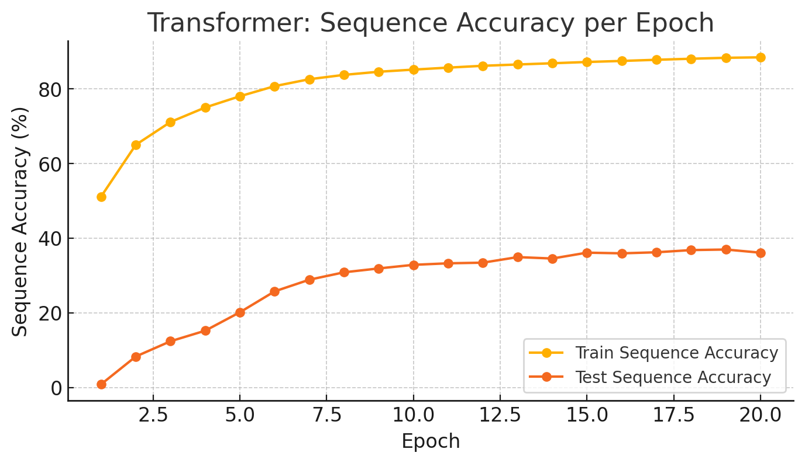

# Maze-Pathfinding-using-Seq2Seq-RNN-Attention-and-Transformer

## 1. Short Description

> Implementation of RNN Encoder–Decoder with Bahdanau Attention and Transformer models for solving 6×6 maze path prediction as a sequence-to-sequence task.

---

## 2. Problem Overview

- Maze represented as tokenized adjacency list + origin + target.
- Task: Predict full path as a token sequence.
- Dataset: 100K 6×6 mazes (forked + forkless).
- Evaluation:
  - Exact Match Sequence Accuracy
  - Token Accuracy
  - Micro-F1 Score
---

## 3. Models Implemented

### 1) RNN + Bahdanau Attention

- 2-layer RNN (hidden size = 512)
- Embedding dim = 128
- Additive attention (Bahdanau)
- Teacher forcing (0.5)
- Gradient clipping
- Padding + masking for variable-length sequences
  

**Results**

- Test Sequence Accuracy: 64.6%
- Test Token Accuracy: 69.0%
- Micro-F1: 69.0%
  

---

### 2) Transformer Encoder–Decoder

- 6 layers
- d_model = 128
- 8 attention heads
- Sinusoidal positional encoding
- Causal masking in decoder
- Shared embeddings
  

**Results**

- Test Token Accuracy: 87.9%
- Test Sequence Accuracy: 37.3%
- Micro-F1: 87.9%
  

---

## 4. Key Observations

- RNN performs better on full-sequence consistency.
- Transformer achieves high token accuracy but lower exact-match accuracy.
- Exposure bias affects Transformer more during inference.
- RNN enforces stronger temporal continuity.
  

---

## 5. Repository Structure

a.py # RNN Encoder & Decoder  
b.py # Positional Encoding  
eval.py # Inference script  
report.pdf # Detailed analysis and plots

---

## 7. How to Run

python a.py  
python b.py  
python eval.py <model_path> <model_type> <input_csv> <output_csv>

---

## 8. What Makes This Project Strong

- Full from-scratch attention implementation
- Proper masking & packed sequences
- Custom evaluation metrics
- Comparative architectural analysis
- Error visualization on maze grids

## RNN with Bahdanau Attention – Qualitative Results

<table align="center">
<tr>
<th>Ground Truth</th>
<th>Predicted</th>
</tr>
<tr>
<td></td>
<td></td>
</tr>
<tr>
<td></td>
<td></td>
</tr>
<tr>
<td></td>
<td></td>
</tr>
</table>

---

## Transformer – Qualitative Results

<table align="center">
<tr>
<th>Ground Truth</th>
<th>Predicted</th>
</tr>
<tr>
<td></td>
<td></td>
</tr>
<tr>
<td></td>
<td></td>
</tr>
<tr>
<td></td>
<td></td>
</tr>
</table>

## Training Curve

 

